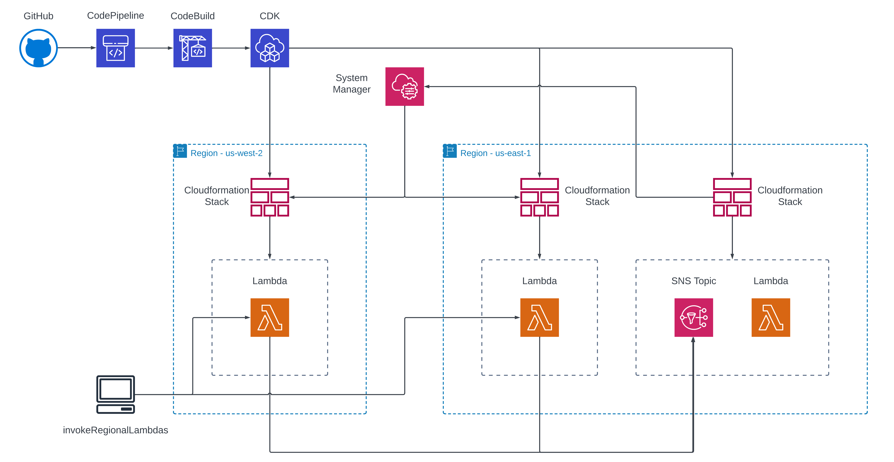

# Multi-Region Pipeline with AWS CDK

This project implements a multi-region deployment pipeline using AWS CDK. It demonstrates how to create a centralized pipeline that can deploy resources across multiple AWS regions, with a focus on passing parameters between stacks and regions.

## Architecture Overview



The solution consists of the following main components:

1. **Central Pipeline Stack**: Orchestrates the deployment across multiple regions.
2. **Data Stack**: Deployed in the primary region (us-east-1) to manage shared resources.
3. **Regional Stacks**: Deployed in each specified region, containing region-specific resources.
4. **SNS Topic**: Used for cross-region communication.
5. **Lambda Functions**: Deployed in each region to demonstrate the multi-region setup.

## Key Features

- **Multi-Region Deployment**: Automatically deploys resources to multiple AWS regions.
- **Cross-Region Parameter Sharing**: Uses SSM Parameter Store to share information across regions.
- **Centralized SNS Topic**: Facilitates communication between regional resources.
- **Dynamic Region Configuration**: Easily add or remove regions from the deployment.
- **Automated CI/CD**: Uses AWS CodePipeline for continuous integration and deployment.

## Prerequisites

- AWS Account
- AWS CLI configured with appropriate credentials
- Node.js and npm installed

## Project Structure
```
.
├── src/
│ ├── config/
│ │ └── regions.ts # Region configuration
│ ├── dataStack/ # Central data stack
│ ├── regionStacks/ # Regional stack definition
│ └── pipeline.ts # Main pipeline definition
├── bootstrapRegions.ts # Script to bootstrap CDK in all regions
├── invokeRegionalLambdas.ts # Script to test regional Lambdas
└── .projenrc.ts # Projen configuration
```

## Deployment

1. Fork the repository

2. Clone your forked repository:
   ```
   git clone https://github.com/your-username/multi-region-pipeline.git
   cd multi-region-pipeline
   ```
3. Configure [CodeStar Connection](https://docs.aws.amazon.com/codepipeline/latest/userguide/connections-github.html) with your AWS Account

4. Update the configuration in `src/multi-region-pipeline.ts` with your information:

```typescript
const pipelineName = 'MultiRegionPipeline';
const repoOwner = 'schuettc';
const repoName = 'multi-region-pipeline-with-parameters';
const repoBranch = 'main';
const connectionArn = 'arn:aws:codeconnections:sa-east-1:104621577074:connection/xxxxxxxxxxxxx';
const accountId = '104621577074';
```

5. Install dependencies:
   ```
   yarn
   ```

6. Bootstrap CDK in all required regions:
   ```
   yarn bootstrapRegions
   ```

7. Build the project:
   ```
   yarn build
   ```

8. Deploy the pipeline:
   ```
   yarn launch
   ```

## How it Works

The regions used in this example are defined in `src/config/regions.ts` file:

```typescript
  export const multiRegionConfig: RegionConfig[] = [
    {
      region: 'us-east-1',
      services: ['service-a', 'service-b', 'service-c'],
    },
    {
      region: 'us-west-2',
      services: ['service-a', 'service-b', 'service-c', 'service-d'],
    },
  ];
  ```

## Pipeline
The pipeline is defined in `src/pipeline.ts` file:

```typescript
    const pipeline = new CodePipeline(this, 'Pipeline', {
      pipelineName: props.pipelineConfig.pipelineName,
      crossAccountKeys: true,
      synth: new ShellStep('Synth', {
        input: CodePipelineSource.connection(
          `${props.pipelineConfig.repoOwner}/${props.pipelineConfig.repoName}`,
          props.pipelineConfig.repoBranch,
          {
            connectionArn: props.pipelineConfig.connectionArn,
          },
        ),
        env: {
          PIPELINE_NAME: props.pipelineConfig.pipelineName,
          REPO_OWNER: props.pipelineConfig.repoOwner,
          REPO_NAME: props.pipelineConfig.repoName,
          REPO_BRANCH: props.pipelineConfig.repoBranch,
          CONNECTION_ARN: props.pipelineConfig.connectionArn,
          ACCOUNT_ID: this.account,
        },
        commands: [
          'yarn install --frozen-lockfile',
          'yarn build',
          'npx cdk synth',
        ],
      }),
    });
```

This provides us the pipeline that we will use to deploy our application.  

## Data Stack

The data stack is deployed in the primary region (us-east-1) and contains resources that are shared across all regions. In this example it contains an SNS Topic that is used to receive events from the regional lambdas.  We then save the ARN of this topic in the SSM Parameter Store, so that we can reference it in the regional stacks. We will add it to the pipeline so that it is deployed to the `us-east-1` region.


```typsccript
    const dataStage = new DataStage(this, 'DataStage', {
      env: { account: this.account, region: 'us-east-1' },
    });
    pipeline.addStage(dataStage);
```
The stack is defined in `src/dataStack/dataStack.ts` file:

```typescript
export class DataStack extends Stack {
  constructor(scope: Construct, id: string, props: StackProps) {
    super(scope, id, props);

    const snsResources = new SNSResources(this, 'SNSResources');
    new LambdaResources(this, 'LambdaResources', snsResources.topic);

    new CfnOutput(this, 'TopicArn', { value: snsResources.topic.topicArn });


    new StringParameter(this, 'TopicArnParam', {
      parameterName: '/mulit-region-pipeline/topic-arn',
      stringValue: snsResources.topic.topicArn,
    });
  }
}
```

## Regional Stacks

The regional stacks are deployed in each region that we have defined in the `multiRegionConfig` array. They contain the resources that are specific to that region. In this example they contain a Lambda function that sends a message to the SNS topic that is shared across regions.  First, we'll add a wave to our pipeline for the regional deployments.

```typescript
    const regionalWave = pipeline.addWave('RegionalDeployments');

    getAllRegions().forEach((region) => {
      const regionalStage = new RegionalStage(this, `RegionalStage-${region}`, {
        env: { account: this.account, region },
      });
      regionalWave.addStage(regionalStage);
    });
```

The Stack that is deployed in each region is defined in `src/regionStacks/regionStack.ts` file:
```typescript
export class RegionStack extends Stack {
  constructor(scope: Construct, id: string, _props: StackProps) {
    super(scope, id, _props);

    const ssmReaders = new SSMReaders(this, 'SSMReaders');

    const topic = Topic.fromTopicArn(this, 'ImportedErrorTopic', ssmReaders.topicArn);
    const lambdaResources = new LambdaResources(this, 'LambdaResources', topic);

    new CfnOutput(this, 'LambdaFunctionName', {
      value: lambdaResources.lambdaFunction.functionName,
      exportName: `${this.stackName}-LambdaFunctionName`,
    });
  }
}
```

In order to read the parameter from the SSM Parameter Store, we will use a Custom Resource that will read the parameter and return the value to the regional stack. This is defined in `src/regionStacks/ssmReader.ts` file:

```typescript
    const ssmPolicy = new PolicyStatement({
      actions: ['ssm:GetParameter'],
      resources: [`arn:aws:ssm:us-east-1:${Stack.of(this).account}:parameter/mulit-region-pipeline/*`],
    });

    const snsTopicArnReader = new AwsCustomResource(this, 'SNSTopicArnReader', {
      onCreate: {
        service: 'SSM',
        action: 'getParameter',
        parameters: {
          Name: '/mulit-region-pipeline/topic-arn',
        },
        region: 'us-east-1',
        physicalResourceId: PhysicalResourceId.of('TopicArnParameter'),
      },
      onUpdate: {
        service: 'SSM',
        action: 'getParameter',
        parameters: {
          Name: '/mulit-region-pipeline/topic-arn',
        },
        region: 'us-east-1',
        physicalResourceId: PhysicalResourceId.of('TopicArnParameter'),
      },
      policy: AwsCustomResourcePolicy.fromStatements([ssmPolicy]),
    });

    this.topicArn = snsTopicArnReader.getResponseField('Parameter.Value');
```

This will allow us to read the parameter from the SSM Parameter Store and use it in the regional stack as an environment variable in the Lambda function.

## Testing
After deployment, you can test the regional Lambda functions using the `invokeRegionalLambdas.ts` script:

```typescript
    yarn invokeRegionalLambdas
```

This will invoke the Lambda functions in each region and print the response to the console.


This script will invoke the Lambda function in each deployed region and display the results.

## Cross-Region Communication

The project demonstrates cross-region communication using a central SNS topic. Regional Lambdas can publish messages to this topic, which can be consumed by a central Lambda function.

## Cleanup

To remove all deployed resources:

```typescript
    yarn cdk destroy
```

## Contributing

Contributions are welcome! Please feel free to submit a Pull Request.

## License

This project is licensed under the MIT-0 License. See the [LICENSE](LICENSE) file for details.